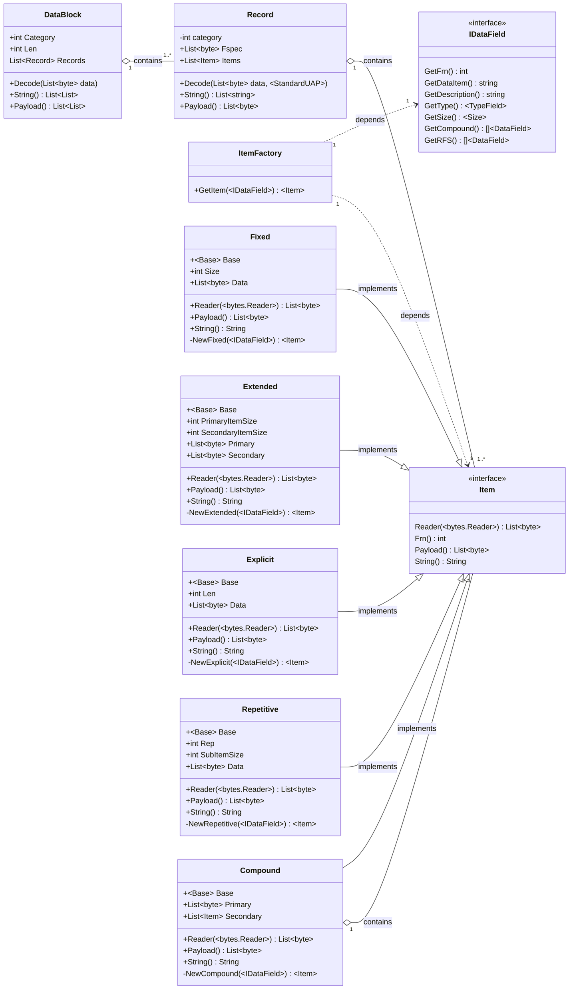

# Items Container Class Diagram

```mermaid
classDiagram
    direction LR
    DataBlock "1" o-- "1..*" Record: contains
    Record "1" o-- "1..*" Item: contains
    
    ItemFactory "1" ..> "1" IDataField: depends
    ItemFactory "1" ..> "1" Item: depends
    Fixed --|> Item: implements
    Extended --|> Item: implements
    Explicit --|> Item: implements
    Repetitive --|> Item: implements
    Compound --|> Item: implements
    Compound "1" o-- "1..*" Item: contains

    class DataBlock{
        +int Category
        +int Len
        List~Record~ Records
        +Decode(List~byte~ data)
        +String() List~List~
        +Payload() List~List~
    }

    class Record{
        -int category
        +List~byte~ Fspec
        +List~Item~ Items
        +Decode(List~byte~ data, ~StandardUAP~)
        +String() List~string~
        +Payload() List~byte~
    }

    class Item{
        <<interface>>
        Reader(~bytes.Reader~) List~byte~
        Frn() int
        Payload() List~byte~
        String() String
    }
    
    class Fixed{
        +~Base~ Base
        +int Size
        +List~byte~ Data
        +Reader(~bytes.Reader~) List~byte~
        +Payload() List~byte~
        +String() String
        -NewFixed(~IDataField~) ~Item~
    }

    class Extended{
        +~Base~ Base
        +int PrimaryItemSize 
	    +int SecondaryItemSize
        +List~byte~ Primary
        +List~byte~ Secondary
        +Reader(~bytes.Reader~) List~byte~
        +Payload() List~byte~
        +String() String
        -NewExtended(~IDataField~) ~Item~
    }

    class Explicit{
        +~Base~ Base
        +int Len
        +List~byte~ Data
        +Reader(~bytes.Reader~) List~byte~
        +Payload() List~byte~
        +String() String
        -NewExplicit(~IDataField~) ~Item~
    }

    class Repetitive{
        +~Base~ Base
        +int Rep
        +int SubItemSize
        +List~byte~ Data
        +Reader(~bytes.Reader~) List~byte~
        +Payload() List~byte~
        +String() String
        -NewRepetitive(~IDataField~) ~Item~
    }
    
    class Compound{
        +~Base~ Base
        +List~byte~ Primary
        +List~Item~ Secondary
        +Reader(~bytes.Reader~) List~byte~
        +Payload() List~byte~
        +String() String
        -NewCompound(~IDataField~) ~Item~
    }
    class ItemFactory{
        +GetItem(~IDataField~) ~Item~
    }
    class IDataField{
        <<interface>>
        GetFrn() int
	    GetDataItem() string
	    GetDescription() string
	    GetType() ~TypeField~
	    GetSize() ~Size~
	    GetCompound() []~DataField~
	    GetRFS() []~DataField~
    }

```