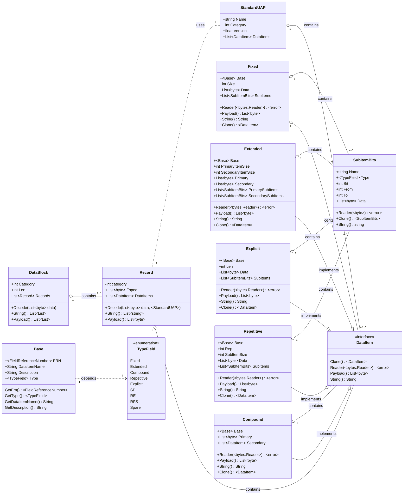

# Package Item Class Diagram

```mermaid
classDiagram
    direction LR    
    DataBlock "1" o-- "1..*" Record: contains
    Record "1" o-- "1..*" DataItem: contains
    Record "1" .. "1" StandardUAP: uses
    StandardUAP "1" o-- "1..*" DataItem: contains
    
    Base "1" ..> "1" TypeField: depends
    
    Fixed "1" o-- "1..*" DataItem: contains
    Fixed "1" o-- "1..*" SubItemBits: contains
    
    Extended --|> DataItem: implements
    Extended "1" o-- "1..*" SubItemBits: contains
    
    Explicit --|> DataItem: implements
    Explicit "1" o-- "1..*" SubItemBits: contains
    
    Repetitive --|> DataItem: implements
    Repetitive "1" o-- "1..*" SubItemBits: contains
    
    Compound --|> DataItem: implements
    Compound "1" o-- "1..*" DataItem: contains

    class TypeField{
        <<enumeration>>
        Fixed
        Extended
        Compound
        Repetitive
        Explicit
        SP
        RE
        RFS
        Spare
    }
    
    class DataBlock{
        +int Category
        +int Len
        List~Record~ Records
        +Decode(List~byte~ data)
        +String() List~List~
        +Payload() List~List~
    }

    class Record{
        -int category
        +List~byte~ Fspec
        +List~DataItem~ DataItems
        +Decode(List~byte~ data, ~StandardUAP~)
        +String() List~string~
        +Payload() List~byte~
    }
    class StandardUAP{
	    +string Name
	    +int Category
	    +float Version
	    +List~DataItem~ DataItems
    }

    class Base{
	    +~FieldReferenceNumber~ FRN
	    +String DataItemName
	    +String Description
	    +~TypeField~ Type
	    GetFrn() ~FieldReferenceNumber~
	    GetType() ~TypeField~
	    GetDataItemName() String
	    GetDescription() String
    }
    class DataItem{
        <<interface>>
        Clone() ~DataItem~
        Reader(~bytes.Reader~) ~error~
        Payload() List~byte~
        String() String
    }
    
    class Fixed{
        +~Base~ Base
        +int Size
        +List~byte~ Data
        +List~SubItemBits~ SubItems
        +Reader(~bytes.Reader~) ~error~
        +Payload() List~byte~
        +String() String
        +Clone() ~DataItem~
    }

    class Extended{
        +~Base~ Base
        +int PrimaryItemSize 
	    +int SecondaryItemSize
        +List~byte~ Primary
        +List~byte~ Secondary
        +List~SubItemBits~ PrimarySubItems
        +List~SubItemBits~ SecondarySubItems
        +Reader(~bytes.Reader~) ~error~
        +Payload() List~byte~
        +String() String
        +Clone() ~DataItem~
    }

    class Explicit{
        +~Base~ Base
        +int Len
        +List~byte~ Data
        +List~SubItemBits~ SubItems
        +Reader(~bytes.Reader~) ~error~
        +Payload() List~byte~
        +String() String
        +Clone() ~DataItem~
    }

    class Repetitive{
        +~Base~ Base
        +int Rep
        +int SubItemSize
        +List~byte~ Data
        +List~SubItemBits~ SubItems
        +Reader(~bytes.Reader~) ~error~
        +Payload() List~byte~
        +String() String
        +Clone() ~DataItem~
    }
    
    class Compound{
        +~Base~ Base
        +List~byte~ Primary
        +List~DataItem~ Secondary
        +Reader(~bytes.Reader~) ~error~
        +Payload() List~byte~
        +String() String
        +Clone() ~DataItem~
    }
    
    class SubItemBits{
        +string Name
        +~TypeField~ Type
        +int Bit
        +int From
        +int To  
        +List~byte~ Data
        +Reader(~byte~) ~error~
        +Clone() ~SubItemBits~
        +String() string
    }
```