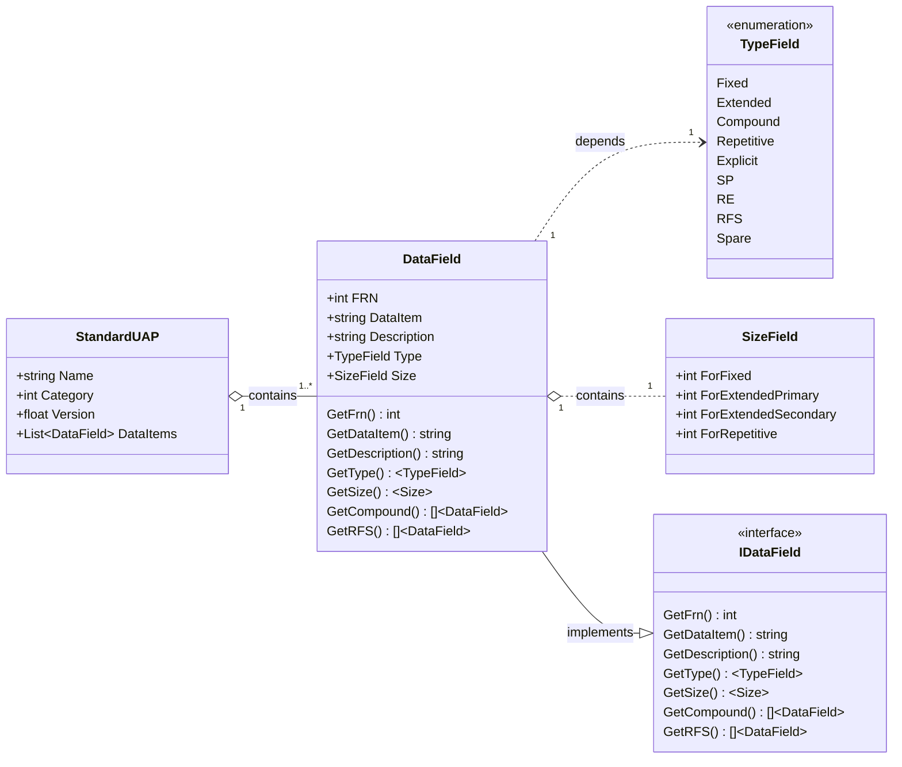

# UAP Class Diagram

```mermaid
classDiagram
    direction LR

    StandardUAP "1" o-- "1..*" DataField: contains
    DataField "1" ..> "1" TypeField: depends
    DataField "1" o.. "1" SizeField: contains
    DataField --|> IDataField: implements

    class StandardUAP{
	    +string Name
	    +int Category
	    +float Version
	    +List~DataField~ DataItems
    }
    class IDataField{
        <<interface>>
        GetFrn() int
	    GetDataItem() string
	    GetDescription() string
	    GetType() ~TypeField~
	    GetSize() ~Size~
	    GetCompound() []~DataField~
	    GetRFS() []~DataField~
    }

    class DataField{
        +int FRN
        +string DataItem
        +string Description
        +TypeField Type
        +SizeField Size
        GetFrn() int
	    GetDataItem() string
	    GetDescription() string
	    GetType() ~TypeField~
	    GetSize() ~Size~
	    GetCompound() []~DataField~
	    GetRFS() []~DataField~
    }
    class SizeField{
        +int ForFixed
        +int ForExtendedPrimary
        +int ForExtendedSecondary
        +int ForRepetitive
    }
    class TypeField{
        <<enumeration>>
        Fixed
        Extended
        Compound
        Repetitive
        Explicit
        SP
        RE
        RFS
        Spare
    }
```
